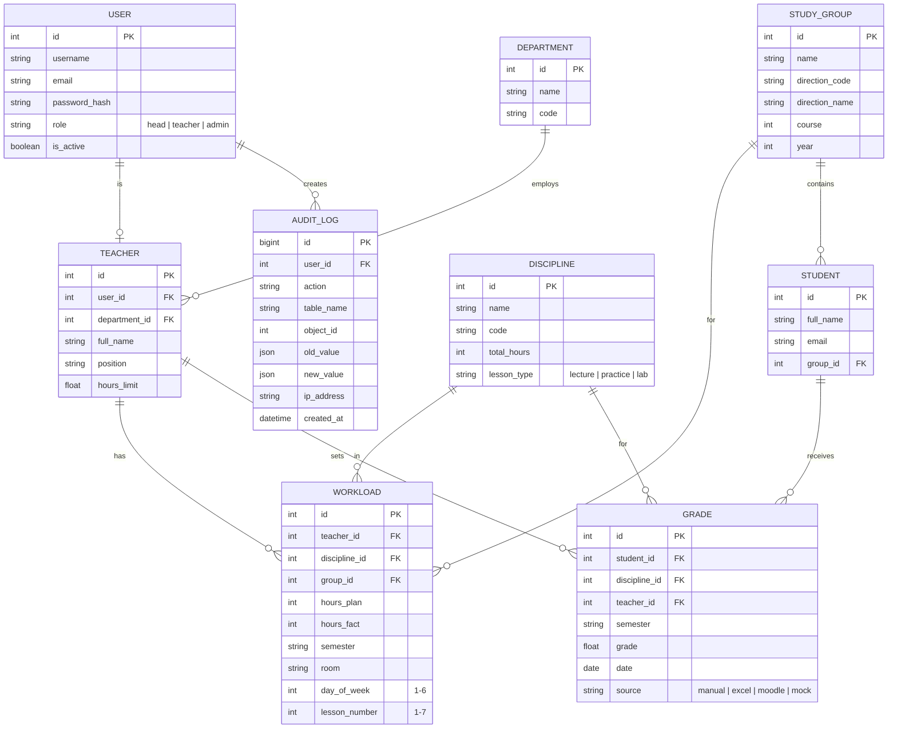

# 📑 Техническое задание (ТЗ)
## ИС «Планирование и мониторинг деятельности кафедры ГиСЭН»
### НФ НИТУ «МИСИС» | Версия 1.0 | 29.09.2026

---

## 1. Общие сведения

| Поле | Значение |
|------|----------|
| **Наименование системы** | ИС планирования и мониторинга деятельности кафедры |
| **Краткое название** | KafIS (Kafedra Information System) |
| **Заказчик** | Кафедра ГиСЭН, НФ НИТУ «МИСИС» |
| **Разработчик** | Студент гр. БПИ-23 (backend + тестирование) |
| **Срок сдачи** | 25 ноября 2026 г. |
| **Среда развёртывания** | Внутренний контур вуза (on-premise) |

---

## 2. Назначение и цели системы

**Проблема:** Документация кафедры (учебные планы, ведомости, нагрузка ППС) хранится в разрозненных Excel-файлах, разных платформах, нет единого центра мониторинга.

**Цель:** Создать централизованное web-приложение, которое:
- Автоматизирует учёт учебной нагрузки
- Собирает данные об успеваемости из Excel / LMS
- Визуализирует KPI кафедры в едином дашборде
- Формирует отчёты для аккредитации

---

## 3. Функциональные требования

### 3.1 Модуль планирования учебной нагрузки (М1)

| ID | Требование |
|----|-----------|
| F1.1 | Добавление/редактирование дисциплин (название, код, кол-во часов, тип: лекция/практика/лаб) |
| F1.2 | Назначение преподавателя на дисциплину + группу |
| F1.3 | Указание аудитории и временного слота (день/пара) |
| F1.4 | Автоматическая проверка пересечений: один преподаватель не может вести 2 занятия одновременно |
| F1.5 | Автоматическая проверка пересечений: одна аудитория не может использоваться дважды в то же время |
| F1.6 | Отображение загруженности преподавателя (план vs факт часов) |
| F1.7 | Импорт нагрузки из Excel (.xlsx) по заданному шаблону |
| F1.8 | Экспорт расписания / нагрузки в Excel и PDF |

### 3.2 Модуль мониторинга успеваемости (М2)

| ID | Требование |
|----|-----------|
| F2.1 | Импорт ведомостей оценок из Excel (.xlsx) |
| F2.2 | Импорт оценок через API LMS (Moodle REST API) |
| F2.3 | Отображение оценок в табличном виде по группам и дисциплинам |
| F2.4 | График динамики средней оценки по группе за семестр |
| F2.5 | Автоматическое выявление студентов в «зоне риска» (средний балл < 3.0 или > N% задолженностей) |
| F2.6 | Фильтрация по: группа / дисциплина / преподаватель / период |
| F2.7 | Экспорт ведомости успеваемости в PDF и Excel |

### 3.3 Модуль KPI и дашбордов (М3)

| ID | Требование |
|----|-----------|
| F3.1 | Главный дашборд: сводные карточки (% успеваемости по направлениям, кол-во студентов в риске, % закрытия часов) |
| F3.2 | Круговая диаграмма: распределение уровней качества образования |
| F3.3 | Гистограмма: нагрузка по преподавателям (план/факт) |
| F3.4 | Линейный график: динамика успеваемости по семестрам |
| F3.5 | Таблица-сводка по направлениям подготовки: дисциплины, группы, часы, % успеваемости |
| F3.6 | Фильтры по: период / кафедра / дисциплина / направление |
| F3.7 | Нижняя панель: «Всего ФИО» | «Мониторинг по группам» | «Карта групп» |

### 3.4 Управление доступом (М4)

| ID | Требование |
|----|-----------|
| F4.1 | Регистрация и аутентификация пользователей (JWT или сессии) |
| F4.2 | Поддержка SSO (корпоративная аутентификация вуза) — если предоставят API |
| F4.3 | Роль «Заведующий кафедрой»: полный доступ ко всем данным и функциям |
| F4.4 | Роль «Преподаватель»: просмотр только своей нагрузки и успеваемости своих групп |
| F4.5 | Роль «Администратор»: управление пользователями и справочниками |
| F4.6 | Audit trail: журнал критических операций (кто, что, когда изменил) |

### 3.5 Импорт / Экспорт (М5)

| ID | Требование |
|----|-----------|
| F5.1 | Импорт из Excel: учебные планы, ведомости оценок, списки ППС, списки студентов |
| F5.2 | Шаблоны Excel для импорта (скачиваемые из интерфейса) |
| F5.3 | Валидация при импорте: сообщения об ошибках с указанием строки |
| F5.4 | Экспорт любого отчёта/таблицы в PDF |
| F5.5 | Экспорт любой таблицы в Excel (.xlsx) |

---

## 4. Нефункциональные требования

| Категория | Требование |
|-----------|-----------|
| **Производительность** | Время отклика страниц ≤ 2 сек при нагрузке до 50 пользователей |
| **Доступность** | Развёрнуто на внутреннем сервере вуза, 5×8 (рабочее время) |
| **Безопасность** | HTTPS, хэш паролей (bcrypt), JWT-токены |
| **152-ФЗ** | Минимум ПДн, разграничение доступа, без передачи данных наружу |
| **Совместимость** | Chrome 110+, Edge 110+, Яндекс Браузер; разрешение от 1366×768 |
| **Резервное копирование** | Ежедневный дамп PostgreSQL |
| **Логирование** | Хранение логов 30 дней, структурированный формат |
| **Мониторинг ошибок** | Sentry (или аналог, развёрнутый on-premise) |

---

## 5. Архитектура системы

```
┌──────────────────────────────────────────────────────┐
│               FRONTEND (React + Vite)                │
│  • Страницы: Дашборд, Нагрузка, Успеваемость, Отчёты│
│  • Графики: Chart.js / Recharts                      │
│  • Стиль: Ant Design                                 │
└─────────────────────┬────────────────────────────────┘
                      │ REST API (JSON)
                      │ HTTPS
┌─────────────────────▼────────────────────────────────┐
│             BACKEND (Python / Django REST)            │
│  ┌─────────────┐ ┌──────────┐ ┌───────────────────┐  │
│  │  Auth Module│ │ Нагрузка │ │  Успеваемость     │  │
│  │  JWT + RBAC │ │  Module  │ │  + Excel Parser   │  │
│  └─────────────┘ └──────────┘ └───────────────────┘  │
│  ┌─────────────┐ ┌──────────┐ ┌───────────────────┐  │
│  │ KPI/Reports │ │LMS Client│ │ Export (PDF/xlsx)  │  │
│  │   Module    │ │ (Moodle) │ │   (WeasyPrint +   │  │
│  └─────────────┘ └──────────┘ │    openpyxl)      │  │
│                               └───────────────────┘  │
└──────────┬────────────────────────┬──────────────────┘
           │                        │
┌──────────▼──────┐      ┌──────────▼──────┐
│   PostgreSQL    │      │      Redis       │
│  (основная БД)  │      │  (сессии, кэш   │
│                 │      │   запросов)      │
└─────────────────┘      └─────────────────┘
```

### Технологии

| Слой | Технология |
|------|-----------|
| **Backend** | Python 3.11+, Django 4.x + Django REST Framework |
| **Frontend** | React 18 + Vite, Ant Design |
| **Графики** | Chart.js / Recharts |
| **БД** | PostgreSQL 15 |
| **Кэш** | Redis 7 |
| **Excel import** | `openpyxl`, `pandas` |
| **PDF export** | `WeasyPrint` или `ReportLab` |
| **Excel export** | `openpyxl` |
| **Auth** | Django JWT (`djangorestframework-simplejwt`) |
| **Деплой** | Docker + Docker Compose, Nginx |
| **API-документация** | Swagger (drf-spectacular) |

---

## 6. ER-диаграмма (основные сущности)



---

## 7. API-эндпоинты (Swagger-описание)

### Аутентификация
```
POST   /api/auth/login/          — получить JWT токен
POST   /api/auth/logout/         — инвалидировать токен
POST   /api/auth/refresh/        — обновить токен
GET    /api/auth/me/             — текущий пользователь
```

### Нагрузка
```
GET    /api/workload/            — список записей нагрузки (фильтры: teacher, group, semester)
POST   /api/workload/            — создать запись
PUT    /api/workload/{id}/       — изменить
DELETE /api/workload/{id}/       — удалить
GET    /api/workload/check-conflicts/  — проверить пересечения
POST   /api/workload/import/    — импорт из Excel
GET    /api/workload/export/    — экспорт в Excel/PDF
```

### Успеваемость
```
GET    /api/grades/              — оценки (фильтры: student, discipline, group, period)
POST   /api/grades/              — добавить оценку
POST   /api/grades/import/       — импорт из Excel / LMS
GET    /api/grades/export/       — экспорт ведомости
GET    /api/grades/risk-zone/    — студенты в зоне риска
GET    /api/grades/dynamics/     — динамика оценок (для графика)
```

### KPI и дашборды
```
GET    /api/kpi/summary/         — сводные карточки дашборда
GET    /api/kpi/quality-levels/  — данные для круговой диаграммы
GET    /api/kpi/workload-chart/  — данные для гистограммы нагрузки
GET    /api/kpi/grades-dynamics/ — данные для линейного графика
GET    /api/kpi/by-direction/    — таблица по направлениям
```

### Справочники
```
GET/POST/PUT/DELETE  /api/teachers/
GET/POST/PUT/DELETE  /api/students/
GET/POST/PUT/DELETE  /api/groups/
GET/POST/PUT/DELETE  /api/disciplines/
GET/POST/PUT/DELETE  /api/departments/
GET/POST/PUT/DELETE  /api/rooms/
```

### Отчёты и экспорт
```
GET    /api/reports/workload-pdf/        — отчёт нагрузки (PDF)
GET    /api/reports/grades-pdf/          — ведомость успеваемости (PDF)
GET    /api/reports/kpi-pdf/             — KPI-сводка (PDF)
GET    /api/reports/workload-excel/      — нагрузка (Excel)
GET    /api/reports/grades-excel/        — ведомость (Excel)
```

---

## 8. Детальный план разработки

### 🏁 Этап 0 — Подготовка (29.09 — 5.10.2026)
- [ ] Финализировать ТЗ (этот документ)
- [ ] Создать репозиторий (Git)
- [ ] Настроить Docker Compose: PostgreSQL + Redis + Django
- [ ] Создать базовую структуру Django-проекта
- [ ] Настроить Swagger (drf-spectacular)

### ⚙️ Этап 1 — Backend Core (6.10 — 20.10.2026)
- [ ] Модели БД (все сущности из ER-диаграммы)
- [ ] Миграции
- [ ] Auth: JWT + роли (RBAC)
- [ ] CRUD API для всех справочников
- [ ] Audit trail middleware
- [ ] Базовые тесты (pytest-django)

### 📥 Этап 2 — Импорт / Парсинг Excel (21.10 — 28.10.2026)
- [ ] Шаблоны Excel для каждого типа данных
- [ ] Парсер нагрузки ППС из Excel (openpyxl)
- [ ] Парсер ведомостей оценок из Excel
- [ ] Парсер списка студентов
- [ ] Валидация при импорте (ошибки со строками)
- [ ] API-эндпоинты импорта

### 🧮 Этап 3 — Бизнес-логика (29.10 — 4.11.2026)
- [ ] Алгоритм проверки пересечений (аудитория / преподаватель)
- [ ] Алгоритм выявления «зоны риска» (настраиваемый порог)
- [ ] Расчёт KPI: % успеваемости, % закрытия часов
- [ ] Интеграция с Moodle REST API (импорт оценок)
- [ ] Unit-тесты для всей бизнес-логики

### 📊 Этап 4 — Отчёты и экспорт (5.11 — 6.11.2026)
- [ ] Экспорт в Excel (openpyxl)
- [ ] Экспорт в PDF (WeasyPrint)
- [ ] Шаблоны отчётов (нагрузка, ведомость, KPI)

### 🖥️ Этап 5 — Frontend (параллельно, 6.10 — 6.11.2026)
- [ ] Настройка React + Vite
- [ ] Роутинг (React Router)
- [ ] Авторизация (JWT в localStorage)
- [ ] Страница: Дашборд (карточки + графики)
- [ ] Страница: Нагрузка (таблица + форма + импорт)
- [ ] Страница: Успеваемость (таблица + зона риска)
- [ ] Страница: Отчёты (кнопки экспорта)
- [ ] Адаптив под 1366×768

### 🧪 Этап 6 — Тестирование (7.11 — 13.11.2026)
- [ ] Интеграционные тесты API
- [ ] Тестирование импорта некорректных Excel-файлов
- [ ] Нагрузочный тест (50 пользователей, ≤ 2 сек)
- [ ] UAT-сценарии с данными кафедры
- [ ] Протокол тестирования (документ)

### 🚀 Этап 7 — Деплой и документация (13.11 — 20.11.2026)
- [ ] Docker Compose production-конфигурация
- [ ] Nginx reverse proxy + HTTPS (self-signed)
- [ ] Деплой на сервер вуза
- [ ] Инструкция по развёртыванию
- [ ] Руководство пользователя

### 🎓 Этап 8 — Защита (20.11 — 25.11.2026)
- [ ] Слайды презентации
- [ ] Демо-сценарий
- [ ] Пояснительная записка (финальная версия)

---

## 9. Матрица ответственности

| Задача | Студент (backend) | Бюрократы |
|--------|:-----------------:|:---------:|
| Backend (Python) | ✅ | — |
| Frontend (React) | ✅ | — |
| Импорт Excel | ✅ | — |
| Деплой | ✅ | — |
| Тестирование | ✅ | — |
| ТЗ-документ | ✅ | ✅ |
| ER-диаграмма | ✅ | ✅ |
| Руководство пользователя | — | ✅ |
| Слайды | — | ✅ |
| Организация встреч | — | ✅ |
| Swagger-документация | ✅ | — |

---

## 10. Риски проекта

| Риск | Вероятность | Влияние | Мера |
|------|:-----------:|:-------:|------|
| Нет доступа к Moodle API | Высокая | Среднее | Мокировать данные через фикстуры |
| Нет сервера для деплоя | Средняя | Высокое | Использовать локальный ПК как сервер или VPS |
| Изменение шаблонов Excel вуза | Средняя | Среднее | Гибкий маппинг колонок при импорте |
| Задержки от бюрократов | Средняя | Среднее | Начать документацию параллельно с кодом |
| Не успеть до 6.11 | Низкая | Высокое | Приоритет: backend + импорт Excel → frontend |

---

## 11. Стек (итог)

```
Python 3.11 / Django 4.2 / DRF / PostgreSQL / Redis / Docker
React 18 / Vite / Ant Design / Chart.js
openpyxl / pandas / WeasyPrint / drf-spectacular
```

---

> **Решения зафиксированы.** Backend — Django. Frontend — React + Ant Design. LMS — через адаптер-заглушку. Дашборды — встроены (Recharts). Деплой — Docker.
